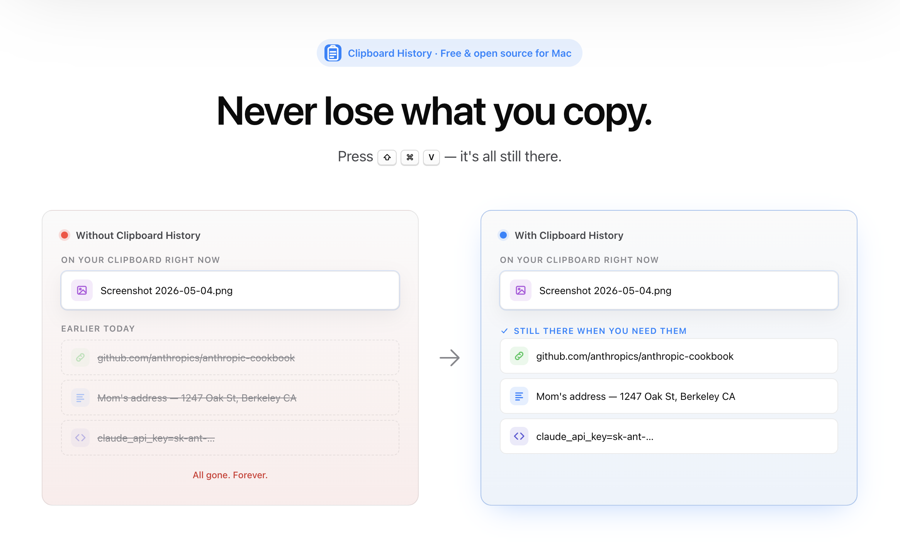

# Clipboard History

A free, open-source clipboard manager for Mac. Never lose what you copy.

> That moment you copy a new thing and realize the old thing is gone forever. Or you copy three things in a row and need all of them.
>
> ⇧⌘V — it's all still there. Paste them in any order.

Works offline. Skips passwords automatically. Stays on your Mac.

[Download for Mac](https://github.com/gug007/clipboard-history/releases) · [clipboard-history.cc](https://clipboard-history.cc/)

## What it does: your clipboard history on Mac

Clipboard History remembers everything you copy — text, links, screenshots, files — so you can paste any of it back later. Copy multiple items in a row and grab whichever one you need.

- **Find anything.** Type a word or two; matching clips jump to the top. Searches inside text, links, and filenames.
- **Paste anywhere.** ⇧⌘V works in every app. Arrow keys to pick, Return to paste.
- **Star your favorites.** Your address, email signature, that one Slack emoji — pinned and never cleaned up.
- **Tiny on disk.** A 5 GB file costs a few kilobytes — the app remembers *where* it lives, not a copy. Keeps your last 1,000 clips by default; up to 10,000.

## Skips your password manager

Most clipboard managers happily save the strings your password manager copies. This one doesn't. When 1Password, Bitwarden, Dashlane, KeePassXC, Apple Passwords, Keychain, or LastPass put something on the clipboard, Clipboard History ignores it — the password lands where you're pasting and never gets recorded.

Recording also pauses inside password fields and on the lock screen. Add more apps to the skip list in Settings.

## Privacy: your clipboard stays on your Mac

A private clipboard manager that runs entirely on your Mac.

- **Stays on your Mac.** No cloud, no account, no telemetry.
- **Signed and approved by Apple.** No scary install warnings; updates are verified before installing.

## Install

1. Download `ClipboardHistory-<version>.dmg` from [Releases](https://github.com/gug007/clipboard-history/releases).
2. Drag **Clipboard History** into your Applications folder.
3. Open it. The clipboard icon in your menu bar (top of screen) is the app — there's no Dock icon.
4. First ⇧⌘V: macOS asks for Accessibility permission so the app can paste for you. Click **Allow**. (Decline and the clip still lands on your clipboard — paste with ⌘V.)

### Requirements

A macOS clipboard manager built for macOS 14 (Sonoma) or later. Apple Silicon or Intel. ~6 MB on disk — a lightweight clipboard manager by design.

## Keyboard shortcuts

The Mac clipboard history shortcut is ⇧⌘V by default. Open the panel, arrow through your history, paste with Return.

| Action | Keys |
| --- | --- |
| Open clipboard history | ⇧⌘V |
| Move up / down | ↑ ↓ |
| Paste highlighted item | ⏎ |
| Pick item 1–9 directly | ⌘1–9 |
| Switch groups | ⌥1–9 |
| Star / un-star | ⌘D |
| Delete | ⌘⌫ |
| Show in Finder | ⌘R |
| Jump to starred | ⇧F |
| Close | ⎋ |

Change ⇧⌘V in Settings.

## FAQ

### Does macOS have a built-in clipboard history?

Yes — macOS 26 Tahoe added one in Spotlight (⌘Space, then ⌘4). It keeps items for 30 minutes, 8 hours, or up to 7 days, depending on the setting. Clipboard History keeps your last 1,000 clips (up to 10,000), doesn't expire them after a few hours, indexes file references instead of copying the file itself, and skips your password manager. If those four things matter to you, install this; if they don't, the built-in one is fine.

### How do I view clipboard history on Mac?

Press ⇧⌘V anywhere. The panel opens, your last copies are listed newest-first, and you can paste any of them. Type to search. Arrow keys to move; Return to paste. Change the shortcut in Settings if ⇧⌘V conflicts with something else you use.

### Is my clipboard history private?

Yes. Everything is stored locally on your Mac. There's no account, no sync, no telemetry, no analytics SDK. The app is sandboxed and signed by Apple. Source is on [GitHub](https://github.com/gug007/clipboard-history) if you want to read it.

### Does it record my passwords?

No. When a known password manager copies something, the clip is ignored and never written to disk. Recording also pauses while you're in a password field or on the lock screen. The skip list ships with 1Password, Bitwarden, Dashlane, KeePassXC, Apple Passwords, Keychain, and LastPass; you can add more in Settings.

### How is this different from Maccy or Paste?

Maccy is a great free, open-source clipboard manager and a fair comparison. Two practical differences: this app skips your password manager out of the box, and it stores file *references* rather than copies (so a 5 GB file in your history costs a few kilobytes). Paste is paid and syncs across devices; this one is free, local, and doesn't sync.

### Why doesn't ⇧⌘V open the panel in some apps?

Almost always it's the Accessibility permission. On first launch macOS asks; if you declined, open System Settings → Privacy & Security → Accessibility and turn on Clipboard History. If a specific app intercepts ⇧⌘V (some IDEs and terminals do), reassign the shortcut in Settings.

