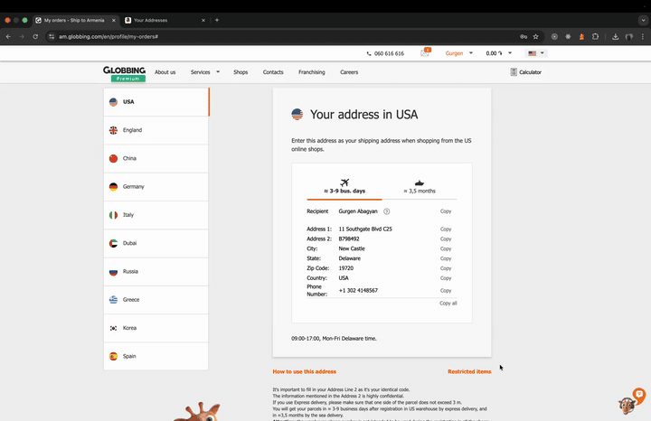

# Clipboard History

**Never lose what you copy.**

> That moment you copy a new thing and realize the old thing is gone forever. Or you copy three things in a row and need all of them.
>
> ⇧⌘V — it's all still there. Paste them in any order.

Free. Open source. Works offline. Skips passwords automatically.

[Download for Mac](https://github.com/gug007/clipboard-history/releases) · [Website](https://clipboard-history.cc/)



## What it does

Clipboard History remembers everything you copy — text, links, screenshots, files — so you can paste any of it back later.

- **Find anything.** Type a word or two; matching clips jump to the top. Searches inside text, links, and filenames.
- **Paste anywhere.** ⇧⌘V works in every app. Arrow keys to pick, Return to paste.
- **Star your favorites.** Your address, email signature, that one Slack emoji — pinned and never cleaned up.
- **Tiny on disk.** A 5 GB file costs a few kilobytes — the app remembers *where* it lives, not a copy. Keeps your last 1,000 clips by default; up to 10,000.

## Your clipboard, yours alone

- **Stays on your Mac.** No cloud, no account, no telemetry.
- **Ignores password managers.** 1Password, Bitwarden, Dashlane, KeePassXC, Apple Passwords, Keychain, LastPass — all skipped. Add more in Settings.
- **Pauses for password fields.** Recording stops in password boxes and the lock screen.
- **Signed and approved by Apple.** No scary install warnings; updates are verified before installing.

## Install

1. Download `ClipboardHistory-<version>.dmg` from [Releases](https://github.com/gug007/clipboard-history/releases).
2. Drag **Clipboard History** into your Applications folder.
3. Open it. The clipboard icon in your menu bar (top of screen) is the app — there's no Dock icon.
4. First ⇧⌘V: macOS asks for Accessibility permission so the app can paste for you. Click **Allow**. (Decline and the clip still lands on your clipboard — paste with ⌘V.)

Requires macOS 14 (Sonoma) or later. Apple Silicon or Intel. ~6 MB.

## Keyboard shortcuts

| Action | Keys |
| --- | --- |
| Open clipboard history | ⇧⌘V |
| Move up / down | ↑ ↓ |
| Paste highlighted item | ⏎ |
| Pick item 1–9 directly | ⌘1–9 |
| Switch groups | ⌥1–9 |
| Star / un-star | ⌘D |
| Delete | ⌘⌫ |
| Show in Finder | ⌘R |
| Jump to starred | ⇧F |
| Close | ⎋ |

Change ⇧⌘V in Settings.

## What's next

Optional iCloud sync for starred clips across Macs — opt-in, off by default. Not shipping yet.

## For developers

```
git clone https://github.com/gug007/clipboard-history.git
open "Clipboard History/Clipboard History.xcodeproj"
```
