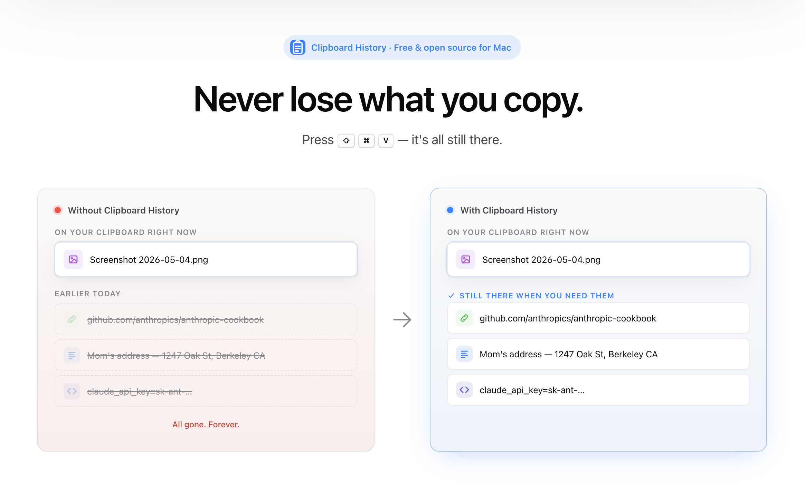
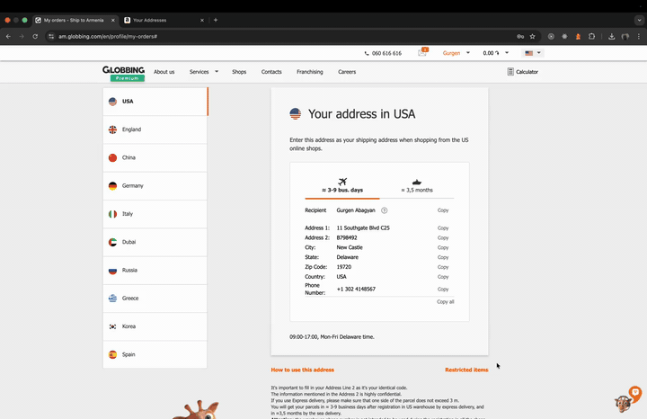

# Clipboard History

**Never lose what you copy.**

> That moment you copy a new thing and realize the old thing is gone forever. Or you copy three things in a row and need all of them.
>
> ⇧⌘V — it's all still there. Paste them in any order.

Free. Open source. Works offline. Skips supported password managers automatically.

[Download for Mac](https://github.com/gug007/clipboard-history/releases/latest) · [Website](https://clipboard-history.cc/)

*See it open with ⇧⌘V:*

## What it does

Clipboard History remembers copied text, links, formatted text, PNG/TIFF clipboard images, and files or folders from Finder so you can paste them back later.

- **Find anything.** Type a word or two; matching clips jump to the top. Searches the full retained history across text, links, filenames, and source apps. Images have previews, but no OCR.
- **Paste anywhere.** ⇧⌘V works in every app. Arrow keys to pick, Return to paste.
- **Star your favorites.** Your address, email signature, that one Slack emoji — pinned and never cleaned up.
- **Tiny on disk.** A 5 GB file costs a few kilobytes — the app remembers *where* it lives, not a copy. Keeps your last 1,000 clips by default; up to 10,000.

## Your clipboard, yours alone

- **Stays on your Mac.** No cloud, no account, no telemetry.
- **Ignores supported password managers.** Current and legacy desktop IDs for 1Password, Bitwarden, Dashlane, KeePassXC, Apple Passwords, Keychain, and LastPass are skipped. Concealed/transient clipboard items are also ignored, and you can exclude more apps in Settings.
- **Signed and approved by Apple.** No scary install warnings; updates are verified before installing.

## Install

1. Download `ClipboardHistory-<version>.dmg` from [Releases](https://github.com/gug007/clipboard-history/releases).
2. Drag **Clipboard History** into your Applications folder.
3. Open it. The clipboard icon in your menu bar (top of screen) is the app — there's no Dock icon.
4. Finish the privacy-first setup. Auto-paste uses an optional macOS permission; without it, the selected clip still lands on your clipboard and you can press ⌘V yourself.

Requires macOS 14 (Sonoma) or later. Apple Silicon or Intel.

## Keyboard shortcuts

| Action | Keys |
| --- | --- |
| Open clipboard history | ⇧⌘V |
| Move up / down | ↑ ↓ |
| Jump a page | ⇞ ⇟ |
| First / last item | ⌘↑ ⌘↓ |
| Paste highlighted item | ⏎ |
| Pick item 1–9 directly | ⌘1–9 |
| Copy without pasting | ⌘C |
| Preview full contents | ⌘Y |
| Next / previous group | ⌃⇥ ⌃⇧⇥ |
| Switch groups | ⌥1–9 |
| Star / un-star | ⌘D |
| Delete | ⌘⌫ |
| Show in Finder | ⌘R |
| Jump to starred | ⌘⇧F |
| Focus the search field | ⌘F |
| Show all shortcuts | ⌘/ |
| Clear search, then close | ⎋ |

Change ⇧⌘V in Settings. Press ⌘/ in the overlay for the same list without leaving the app. Drag any edge of the overlay to resize it — the size is remembered.
